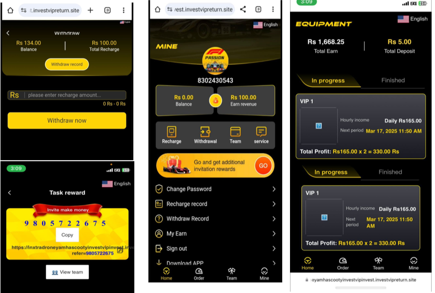
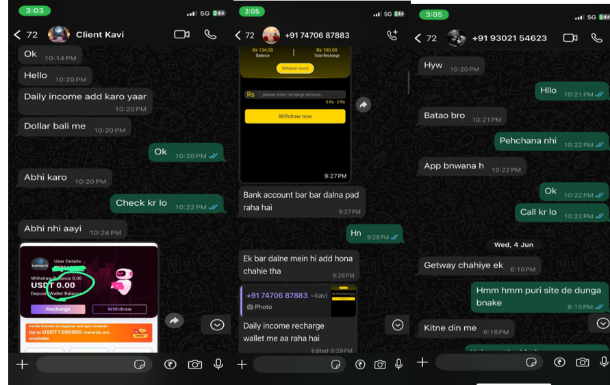

# 💰 Client-Based Investing Website Deployment & Setup

I worked with multiple clients to deliver complete investing platforms. I purchased premium source codes and handled everything from *deployment to customization* based on client needs.

## 🔧 My Responsibilities
- ✅ Hosting setup (cPanel, Hostinger, GoDaddy, etc.)
- ✅ Database creation and connection configuration
- ✅ Codebase setup on server
- ✅ Customization of:
  - Product Prices
  - Daily Income Logic
  - Wallet Recharge/Withdraw Logic
- ✅ Admin Panel Configuration
- ✅ Group Support & WhatsApp Integration
- ✅ Client Communication & Delivery

## 👨‍💻 Technologies Involved
- PHP / Laravel / HTML / JS (depending on source code)
- MySQL database
- cPanel Hosting
- Admin Panel + User Dashboard

## 📸 Proof of Work

### 🔹 User Dashboard

### 🔹 Video Proof

### 🔹 Client Discussion (Blurred)

## 🧠 What I Learned
- Real client project deployment
- Customizing existing codebase based on business logic
- Managing admin/user roles
- Hosting & production-level setup
